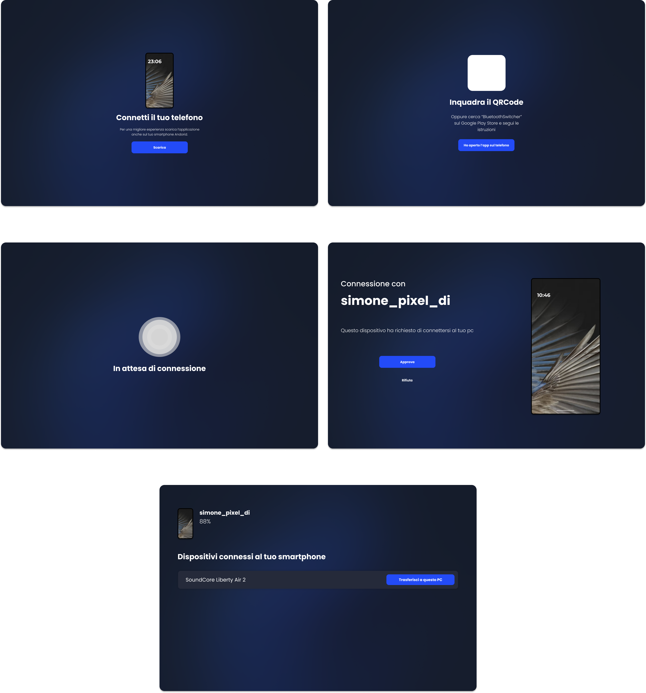
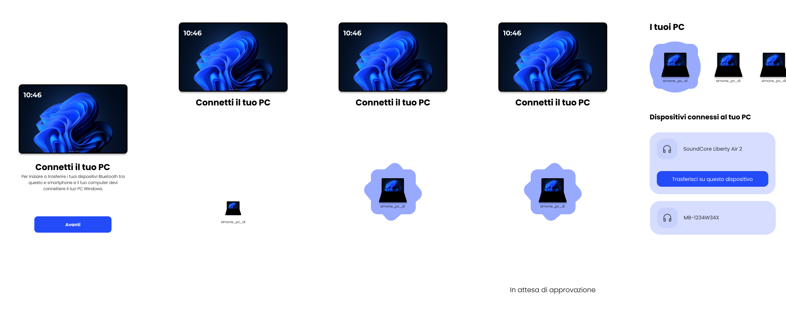

Prototype Images
# Bluetooth Switcher

Bluetooth Switcher is a cross-platform solution for seamlessly sharing Bluetooth devices between Windows PCs and Android smartphones. This project consists of a Windows client application built using Compose Desktop and an Android app developed using Kotlin. With Bluetooth Switcher, you can easily switch and manage your Bluetooth devices without the hassle of repetitive pairing and unpairing.

## Roadmap

- ✅ Prototype
- ✅ Build zeroconf discover (Maybe can be replaced with BLE Discover)
- ✅  Create a socket server to ensure data exchange between clients  
- [ ]  Encrypt data 🔒
- ✅  Approve Android connection at PC
- [ ]  Generate token 📲💻
- [ ]  Show connected Android devices (Windows Client) 💻
- [ ]  Show connected PC devices (Android) 📱
- [ ]  Show connected Bluetooth devices (Windows & Android) 🖧
- [ ]  Observe if some media is reproduced (Windows & Android) ▶️🔊
- [ ]  Notification 📢
- [ ]  ... to be defined 📝

## Features 🚀

- **Cross-Platform Compatibility:** The project supports both Windows and Android platforms, allowing you to share Bluetooth devices effortlessly between your devices.

- **User-Friendly Interface:** The Windows client and Android app offer intuitive interfaces that make it simple to manage your shared Bluetooth devices.

- **Efficient Device Switching:** Say goodbye to the tedious process of pairing and unpairing devices. Bluetooth Switcher streamlines the device switching process, enhancing your overall Bluetooth experience.

## Prototype Images 📷




## Installation and Usage 🛠️

### Windows Client
### Android App

## Contributing 🤝
Contributions are welcome and encouraged! If you'd like to contribute to the project, please follow these steps:

1. Fork the repository and clone it to your local machine.
2. Create a new branch for your feature or bug fix.
    
    ```sh
    git checkout -b feature/new-feature

3. Make your changes and test thoroughly.

4. Commit your changes with descriptive commit messages.

    ```sh
    git commit -m "Add new feature: ..."

5. Push your changes to your forked repository.

    ```sh
    git push origin feature/new-feature

6. Open a pull request against the main branch of this repository.

## License 📜
This project is licensed under the MIT License, which means you're free to use, modify, and distribute the code as long as you include the original license notice.

## Contact 📧
If you have any questions, suggestions, or feedback, feel free to open an issue in the GitHub repository or contact the maintainers directly.

*Happy Bluetooth switching!*


## 

Made with ❤️ by Simone Silvestri
